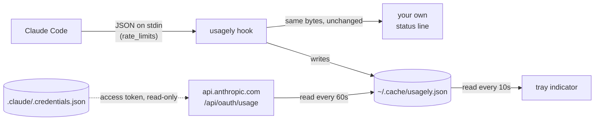

# Usagely

Claude Code usage limits in your Linux system tray.

```
Claude Code
─────────────────────────────────────────────
5-Hour   ███████░░░   71%   resets in 1h 53m
7-Day    █░░░░░░░░░   10%   resets in 6d 9h
─────────────────────────────────────────────
Updated 11:06
Quit
```

## Read-only, never refreshed

Usagely reads your Claude Code login. It never writes it.

Two sources feed the tray, and neither can log you out.

**The status line hook, free and offline.** Claude Code passes `rate_limits` to
whatever command you configure as its
[status line](https://code.claude.com/docs/en/statusline). `usagely hook` sits
in that slot, writes the numbers to `~/.cache/usagely.json`, and passes stdin
straight through to the status line you already had.

**The usage endpoint, for when Claude Code is closed.** The hook only fires
while a session is running, so the tray used to go blind the moment you quit -
and it never saw usage from your other machines or from claude.ai at all. Once a
minute the tray reads the OAuth access token out of
`~/.claude/.credentials.json` and asks `api.anthropic.com/api/oauth/usage` for
the account's live windows. That is the same endpoint Claude Code's own `/usage`
command reads.



### Why it cannot log you out

Anthropic's OAuth refresh tokens are single-use and rotating. A tool that
spends yours races Claude Code for it, and the loser gets logged out. Plenty of
usage monitors do exactly that.

Usagely never spends the refresh token, and never writes the credentials file.
It sends the access token Claude Code already minted, and nothing else. When
that token expires - roughly eight hours after Claude Code last ran - the fetch
simply fails and the tray keeps showing the last snapshot with its capture time.
Start Claude Code and the next poll picks up the renewed token on its own.

If you would rather it never read the file at all, `usagely hook` on its own is
the original offline setup: delete nothing, just know the tray goes stale
between sessions.

## Cache warmth - the other way you lose tokens

Every Claude Code session keeps a server-side prompt cache with a one-hour TTL.
While it is warm, resending your conversation costs **0.1x** the input price.
Once it lapses, the next message rewrites the whole context at **2x** - a
twentyfold jump, charged against the same 5-hour window the tray is watching.
On a large session that is hundreds of thousands of tokens for typing "carry on".

The tray grows a `Prompt cache` section listing what is still warm, soonest to
expire first, with a coloured dot that goes amber then red as the window closes.
Hovering a row gives the exact token count and what to do about it. With nothing
warm the section hides itself and the menu looks exactly as it did before.

```
Claude Code
─────────────────────────────────────────────
5-Hour   ███░░░░░░░   29%   resets in 2h 33m
7-Day    █░░░░░░░░░    9%   resets in 1d 0h
─────────────────────────────────────────────
Prompt cache
shapehill                        40k · 59m
Usagely                         192k · 59m
─────────────────────────────────────────────
Updated 00:06
```

For the full list, including the exact counts:

```sh
usagely sessions
```

```
Claude Code prompt caches
────────────────────────────────────────────
running  Usagely                        59m left 170,600 cached
closed   shapehill                       8m left 197,771 cached
────────────────────────────────────────────
```

Ten minutes before a cache lapses, the tray sends a desktop notification naming
the project and what is at stake. Closed sessions are included on purpose: the
cache lives on Anthropic's side, keyed by the conversation prefix rather than by
your process, so a session you quit an hour ago is still warm and still worth
resuming. Caches under 20,000 tokens are ignored - re-warming those is noise.

Nothing here is guesswork. Claude Code records the cached prefix size and which
TTL bucket it used in each turn of `~/.claude/projects/*/*.jsonl`, so both the
countdown and the token figure are read rather than estimated.

## Install

Requires a Claude Pro or Max subscription - `rate_limits` is absent otherwise,
and the tray will say so rather than showing a made-up zero.

### Install the released binary

No clone, no source tree - Go fetches and builds it for you:

```sh
go install github.com/omjogani/usagely@latest
usagely install     # autostart entry + status line hook (backs up settings.json)
usagely &
```

`go install` puts the binary in `$(go env GOPATH)/bin`, so make sure that is on
your `PATH`.

### Build from source

For hacking on it, or if you would rather read the code before running it:

```sh
git clone https://github.com/omjogani/Usagely
cd Usagely
go build -o ~/.local/bin/usagely .
usagely install
usagely &
```

`usagely uninstall` reverses both, restoring your original status line.

### Upgrade

```sh
usagely upgrade
```

It needs the Go toolchain, same as installing did. If you built from source into
a different directory, it will tell you the upgraded binary is not the one on
your `PATH`.

## Debug - when the numbers look wrong

`usagely status` prints what the tray is showing and when it was captured. To
compare that against what Claude Code actually sent, keep a copy of the raw
payload:

```sh
touch ~/.cache/usagely.json.debug    # then read ~/.cache/usagely.json.payload
rm ~/.cache/usagely.json.debug       # to stop
```

The flag file is checked on every status line refresh, so no restart is needed.

## Desktop support

The tray uses [StatusNotifierItem](https://www.freedesktop.org/wiki/Specifications/StatusNotifierItem/)
over D-Bus, so it works on KDE, XFCE, Cinnamon, Budgie, COSMIC and most Wayland
bars with no extra libraries. GNOME has no tray of its own and needs the
[AppIndicator extension](https://extensions.gnome.org/extension/615/appindicator-support/).
Ubuntu and Pop!_OS ship it enabled already.

## Limits

- The tray goes stale if Claude Code has not run in about eight hours, which is
  when its access token expires. `usagely status` always shows the capture time,
  so a stale reading never passes for a fresh one.
- No per-model rows yet. The usage endpoint does report `seven_day_opus` and
  `seven_day_sonnet`; the tray does not draw them.
- Linux only. The tray is StatusNotifierItem over D-Bus.
- The cache countdown starts from a session's last message. If Anthropic extends
  a cache's TTL each time it is read, that is exactly right; if the clock instead
  runs from the first write, the countdown is optimistic and the real warning
  should come sooner.
