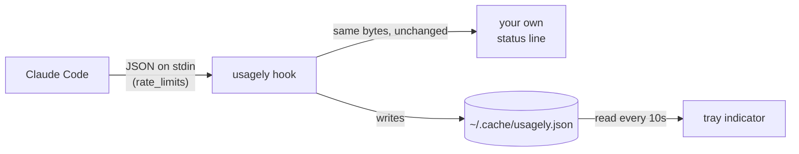

# Usagely

Claude Code usage limits in your Linux system tray.

```
Claude Code
─────────────────────────────────────────────
5-Hour   ███████░░░   71%   resets in 1h 53m
7-Day    █░░░░░░░░░   10%   resets in 6d 9h
─────────────────────────────────────────────
Updated 11:06
Quit
```

## No credentials, no network

Usagely never reads your Claude credentials and never makes an API call.

Claude Code passes `rate_limits` to whatever command you configure as its
[status line](https://code.claude.com/docs/en/statusline). `usagely hook` sits
in that slot, writes the numbers to `~/.cache/usagely.json`, and passes stdin
straight through to the status line you already had. The tray reads that file.

```
statusline hook  →  ~/.cache/usagely.json  →  tray
```

This matters: Anthropic's OAuth refresh tokens are single-use and rotating, so
tools that read `~/.claude/.credentials.json` and refresh it can log you out of
Claude Code. Usagely can't, because it never touches them.



## Install

Requires a Claude Pro or Max subscription - `rate_limits` is absent otherwise,
and the tray will say so rather than showing a made-up zero.

### Install the released binary

No clone, no source tree - Go fetches and builds it for you:

```sh
go install github.com/omjogani/usagely@latest
usagely install     # autostart entry + status line hook (backs up settings.json)
usagely &
```

`go install` puts the binary in `$(go env GOPATH)/bin`, so make sure that is on
your `PATH`.

### Build from source

For hacking on it, or if you would rather read the code before running it:

```sh
git clone https://github.com/omjogani/Usagely
cd Usagely
go build -o ~/.local/bin/usagely .
usagely install
usagely &
```

`usagely uninstall` reverses both, restoring your original status line.

### Upgrade

```sh
usagely upgrade     # re-runs go install ...@latest, then restart the tray
```

It needs the Go toolchain, same as installing did. If you built from source into
a different directory, it will tell you the upgraded binary is not the one on
your `PATH`.

## Debug - when the numbers look wrong

`usagely status` prints what the tray is showing and when it was captured. To
compare that against what Claude Code actually sent, keep a copy of the raw
payload:

```sh
touch ~/.cache/usagely.json.debug    # then read ~/.cache/usagely.json.payload
rm ~/.cache/usagely.json.debug       # to stop
```

The flag file is checked on every status line refresh, so no restart is needed.

## Desktop support

The tray uses [StatusNotifierItem](https://www.freedesktop.org/wiki/Specifications/StatusNotifierItem/)
over D-Bus, so it works on KDE, XFCE, Cinnamon, Budgie, COSMIC and most Wayland
bars with no extra libraries. GNOME has no tray of its own and needs the
[AppIndicator extension](https://extensions.gnome.org/extension/615/appindicator-support/).
Ubuntu and Pop!_OS ship it enabled already.

## Limits

- Only counts usage from this machine. claude.ai in a browser won't show up.
- Percentages refresh while Claude Code is running. Between sessions the
  countdown keeps ticking and each window reads zero once it resets.
- No per-model rows. The status line reports `five_hour` and `seven_day` only.
